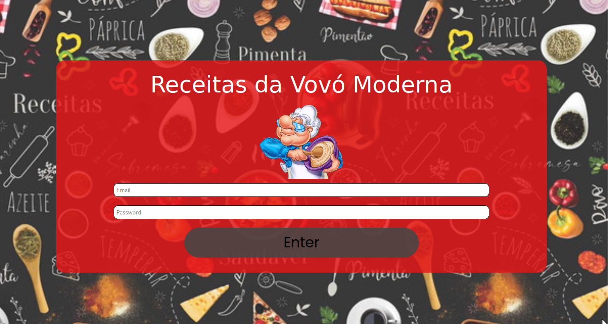
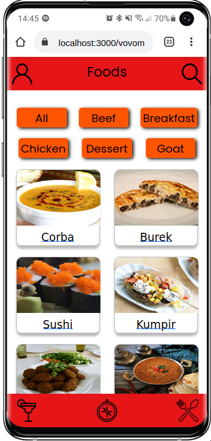
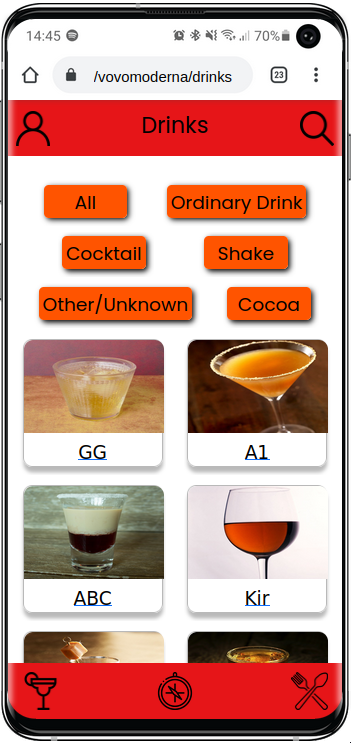

# 🥞 VovóModerna



## Acesse o projeto clicando <a href="https://vovomoderna.vercel.app/">AQUI</a>

<br />

## 📡 Desenvolvimento

Projeto desenvolvido por <a href="https://www.linkedin.com/in/eliedson-gomes/" target="_blank">Eliedson Gomes</a>, <a href="https://www.linkedin.com/in/joaovictorschiavon/" target="_blank">Joao Victor</a>, Robson Silva, Marciel Santana, Rafael Bleyer, na <a href="https://betrybe.com/" target="_blank">Trybe</a> durante o módulo de Front-End!

Nesse projeto em grupo desenvolvemos um aplicativo de Receitas, onde você pode aprender com novas receitas, já conhecidas, compartilhe o link dela para seus amigos e acompanhar seu progresso em quantas receitas já foram feitas. Utilizamos duas APIs públicas para as informações das receitas.

<br />

## 🚀 Instalação e execução

  <details>
    <summary>Instalando e executando</summary>
    <br />

### 1 - Clone o repositório:

```
git clone git@github.com:Eliedson1979/vovomoderna.git
```

### 2 - Apos ter o repositório clonado em sua maquina, execute este comando para acessar a pasta do projeto:

```sh
cd vovomoderna
```

### 3 - Dentro da pasta do projeto, execute o comando abaixo para instalar as dependências do projeto:

Caso utilize o npm:

```sh
npm install
```

Caso utilize o yarn:

```sh
yarn install
```

### 4 - Dentro da pasta do projeto, execute o comando abaixo para iniciar o servidor do projeto:

Caso utilize o npm:

```sh
npm start
```

Caso utilize o yarn:

```sh
yarn start
```

### 5 - Acesse a aplicação:

Abrindo na porta padrão que o React usa: <http://localhost:3000/> em seu navegador.

  </details>
<br />

## 📜 Metodologias

- Mobile First
- Kanban
- Scrum
- Trello

<br />

## ⚙️ Tecnologias

- HTML5
- CSS
- JavaScript ES6+
- React.js
- Context API
- React Icons
- React Testing Library (RTL)

<br />

## 👥 Equipe

<br />
<table>
  <tr>
      <td align="center">
      <a href="https://github.com/Eliedson1979">
        <br>
        <sub>
          <b>Eliedson Gomes</b>
        </sub>
      </a>
    </td>
      <td align="center">
      <a href="https://github.com/joaovictorschiavon">
        <br>
        <sub>
          <b>João Victor</b>
        </sub>
      </a>
    </td>
        <td align="center">
      <a href="https://github.com/rafabzf">
        <br>
        <sub>
          <b>Rafael Bleyer</b>
        </sub>
      </a>
    </td>
    <td align="center">
      <a href="https://github.com/rm-l">
        <br>
        <sub>
          <b>Robson Silva</b>
        </sub>
      </a>
    </td>
    <td align="center">
      <a href="https://github.com/MarcielSantana">
        <br>
        <sub>
          <b>Marciel Santana</b>
        </sub>
      </a>
    </td>
  </tr>
</table>

<br />

# 📷 Screenshots




#
